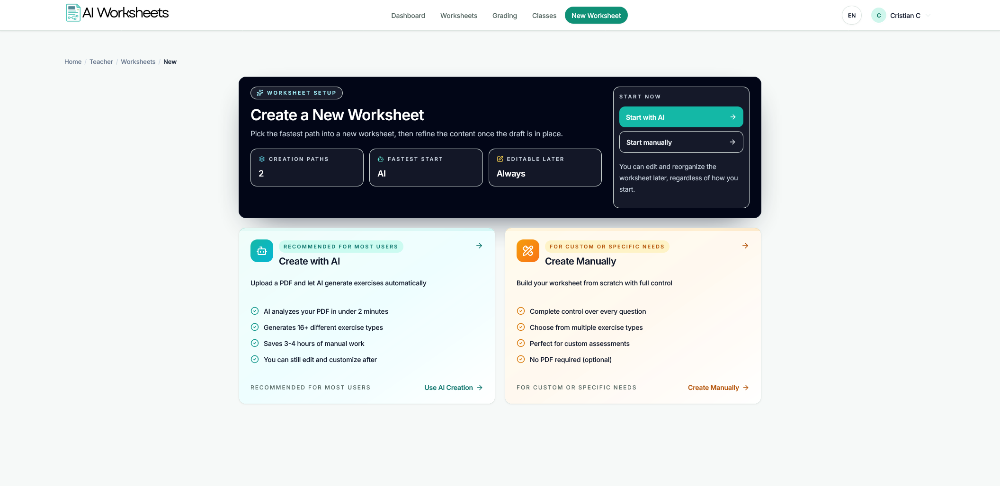
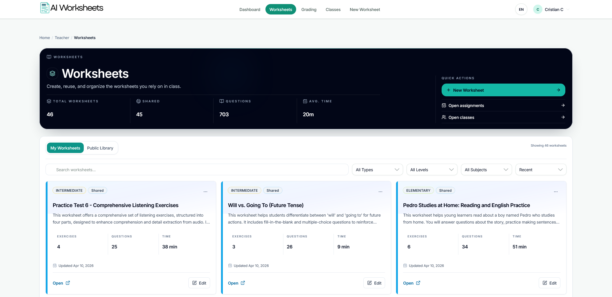
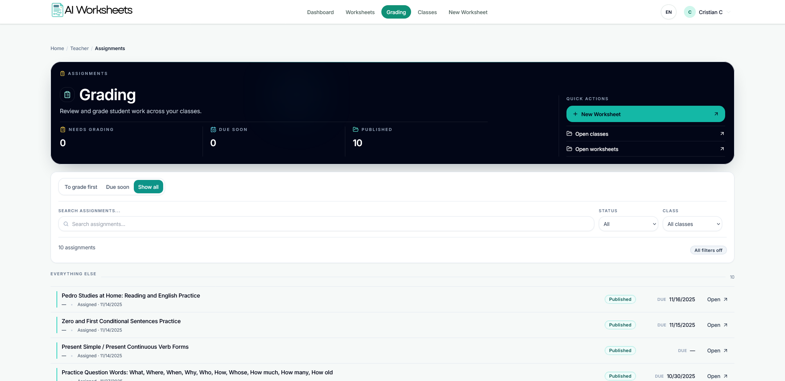

# AI Worksheets Showcase

This repository is a public showcase for **AI Worksheets**, a private full-stack educational platform I have been building solo.

The source code for the product is not public. This repo exists to document the product direction, core workflows, and technical scope without exposing the implementation.

## Live Product

- [Live app](https://app.aiworksheets.io/)

## What It Solves

Teachers spend too much time turning static worksheet content into usable classroom activities, then more time collecting, reviewing, and grading student work.

AI Worksheets is designed to reduce that overhead by turning worksheet content into interactive, auto-graded learning experiences while still giving teachers control over the final result.

## Current Product Scope

The platform is still a work in progress and has not been officially launched yet, but the current product already covers:

- Worksheet creation workflows
- AI-assisted worksheet generation
- Manual worksheet creation and editing
- Worksheet preview and library management
- Assignment workflows
- Grading workflows
- Teacher and student product surfaces

## Tech Stack

- **Frontend:** TypeScript, React, Next.js
- **Backend:** Node.js, Express
- **Data/Auth:** Supabase
- **Testing/Tooling:** Jest, Playwright, ESLint, Prettier, monorepo workflows
- **Development approach:** AI-assisted implementation with product, architecture, testing, refactoring, and deployment decisions owned directly

## Product Screens

### New Worksheet Flow

Teachers can choose between AI-assisted worksheet creation and manual authoring depending on the kind of material they are working with.

### Worksheet Library

The worksheet library gives teachers a single place to manage, filter, preview, and reuse worksheet content across their workflow.

### Grading Workflow

Assignments and grading surfaces are designed to help teachers review published work quickly and stay on top of classroom activity without extra admin overhead.

## Architecture Overview

The private application is structured as a production-style TypeScript monorepo with:

- A **Next.js / React** client
- An **Express + TypeScript** API
- Shared domain types and utilities
- **Supabase** for auth, data, and storage
- Automated linting, typechecking, and test workflows

## Why This Repo Exists

My strongest project is private, but I still wanted a public artifact that shows what I am building and the level of product and engineering ownership involved.

This repo is intentionally focused on:

- product direction
- technical scope
- public-safe screenshots
- architecture summary

Rather than exposing the source itself.

## Links

- [LinkedIn](https://www.linkedin.com/in/crismch/)
- [Portfolio](https://crischportfolio.netlify.app/)
